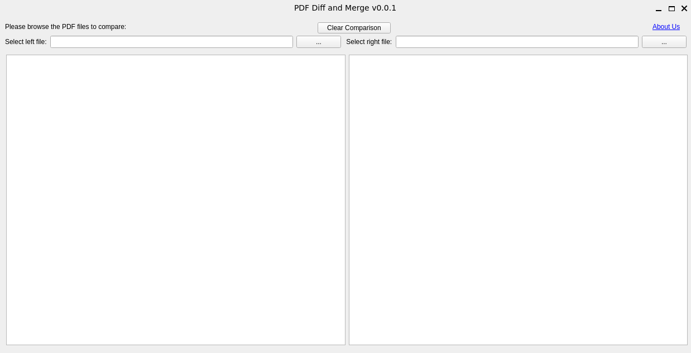

PDF diff, compare and merge tool is a software application that allows users to compare and merge multiple PDF files. Users can select two or more PDF files and view the differences between them in a side-by-side or overlay mode. Users can also edit, annotate, and comment on the PDF files, as well as merge them into a single PDF file. PDF diff, compare and merge tool supports various PDF features, such as bookmarks, hyperlinks, forms, annotations, and digital signatures. PDF diff, compare and merge tool is compatible with Windows, Mac, and Linux operating systems, and can be integrated with popular version control systems, such as Git, SVN, and Mercurial.

# Features:

- Compare and merge multiple PDF files in a fast and easy way
- View the differences between PDF files in a side-by-side or overlay mode
  -- The text and OCR image differences can be seen on layers.
- Edit, annotate, and comment on the PDF files with various tools
- Merge PDF files into a single PDF file with a few clicks
- Support various PDF features, such as bookmarks, hyperlinks, forms, annotations, and digital signatures
- Compatible with Windows, Mac, and Linux operating systems
- Integrate with popular version control systems, such as Git, SVN, and Mercurial

# Usage:

The program is still under development.
You can get the source code and run with python.

# Dependencies:

